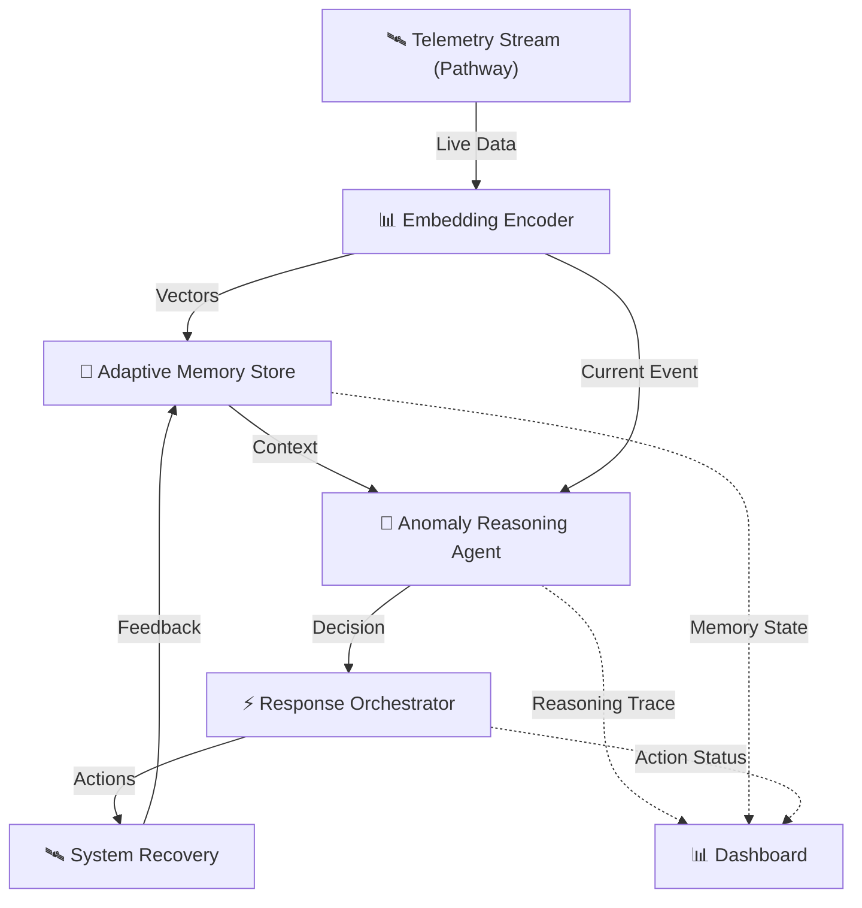

<div align="center">
  <br />
  
  <br />

# 🛰️ AstraGuard AI

**Autonomous Fault Detection & Recovery for CubeSats**
*Powered by Pathway's Streaming Engine & Biologically-Inspired Memory*

[](https://opensource.org/licenses/MIT)
[](https://www.python.org/downloads/)
[](https://github.com/psf/black)
[](https://pathway.com/)
[](https://github.com/sr-857/AstraGuard)

<br />

**Explore the Project:**

🌐 **[Live Site](https://sr-857.github.io/AstraGuard/)** | 📊 **[Dashboard Prototype](https://astraguarddashboard.lovable.app/)** | 📚 **[Documentation](docs/TECHNICAL.md)** | 🎥 **[Demo Video](https://drive.google.com/file/d/1pKkZosBJdk8tvfBrqNelPeWyY265eOcI/view?usp=drive_link)** | 🗂️ **[Resources (GDrive)](https://drive.google.com/drive/folders/1j3Ra1_q6v-lEavG40eR2mRzVLcqDYYKH)**

📌 **[View Official Report](https://drive.google.com/file/d/17Vvhz9CNO_fVLpxJTH2eKSktByT3HnKt/view)**

</div>

---

## 🚀 Mission Brief

**Space is unforgiving. AstraGuard makes it manageable.**

AstraGuard AI is an intelligent autonomous system designed to protect CubeSats from catastrophic failure. Unlike traditional "alert-only" systems, AstraGuard uses **agentic reasoning** to detect anomalies in real-time streams, recall historical context using adaptive memory, and execute autonomous recovery actions—all with sub-second latency.

> **"Streaming anomalies. Self-updating memory. Decisions that trigger actions."**

---

## ⚡ System Preview

> *[Tip: Place a GIF here showing the Dashboard detecting an anomaly and the Agent auto-correcting it]*

---

## 🏆 Innovation & Differentiators

We moved beyond static RAG to build a system that *learns* from the stream.

| Feature | The Old Way (Static) | The AstraGuard Way (Adaptive) |
| :--- | :--- | :--- |
| **Data Processing** | Batch processing (slow) | **Streaming Intelligence (5Hz)** via Pathway |
| **Memory** | Static vector databases | **Evolving Memory** with decay & pruning |
| **Response** | Passive Alerts | **Agentic Action** (detect → reason → act) |
| **Explainability** | Black box "magic" | **Transparent Decision Traces** |
| **User Interface** | Terminal logs | **Frontier Dashboard** with neural viz |

---
<div align="center">
  
</div>


## 🎯 What's Different Here

- ✅ **Works on streams, not static input** - Real-time telemetry processing
- ✅ **Memory evolves and prunes itself** - Temporal weighting with decay curves
- ✅ **Agent reasons before acting** - Explainable decision traces
- ✅ **Actions feed back into memory** - Continuous learning loop
- ✅ **Dashboard outputs are structured** - Validated, predictable responses

---

## ✨ Key Features

| Component | Description |
|-----------|-------------|
| **🛰️ Real-time Streaming** | Pathway Engine processes data continuously at 5Hz |
| **🧠 Adaptive Memory** | Temporal weighting + recurrence scoring + safe decay |
| **🤖 Agentic Decisions** | detect → recall → reason → act → learn loop |
| **⚡ Auto-Recovery** | Concrete actions (not just alerts) with < 2s latency |
| **📊 Premium Dashboard** | Glassmorphism UI with Frontier Mode visualization |
| **🔬 Experimental Feature** | Anomaly Recurrence Resonance Score (signal reinforcement) |

---

## 🏗️ System Architecture



### Modular Architecture

```
AstraGuard/
├── memory_engine/          # Adaptive memory with temporal weighting
├── anomaly_agent/          # Decision loop + reasoning engine
├── response_orchestrator/  # Workflow registry + action triggers
├── encoder/                # Event embedding
├── pathway_ingestion/      # Stream handlers
├── dashboard/              # Streamlit UI
├── tests/                  # Comprehensive test suite
├── examples/               # Run-ready demos
└── docs/                   # Architecture & design docs
```

---

## 🚀 Getting Started

### Prerequisites
- Python 3.9+
- pip & git

### Installation

```bash
git clone https://github.com/sr-857/AstraGuard.git
cd AstraGuard
pip install -r requirements.txt
```

### Verify Installation

```bash
python verify_install.py
```

### Quick Start

**Run the demo:**
```bash
python examples/run_demo.py
```

**Launch dashboard:**
```bash
streamlit run dashboard/app.py
```

> [!TIP]
> Enable **Frontier Mode** in the dashboard to visualize adaptive memory flow and BDH neural activity!

---

## 📊 Performance Metrics

| Metric | Target | Actual |
|--------|--------|--------|
| Detection → Decision → Action | < 2s | ~325ms |
| Memory Retrieval | < 50ms | ~38ms |
| Embedding Encoding | < 20ms | ~12ms |
| Memory Updates | Auto | ✓ Real-time |
| Explainability | LLM-assisted | ✓ Plain language |

---

## 🏆 Build-athon Tracks

### 🤖 Track 1: Agentic AI (Applied GenAI)
**Mission:** Reactive AI agent system for live threat detection and autonomous response.

**Workflow:**
```
Live Input → Anomaly Detection → Memory Recall → Intelligent Decision → Automated Action
```

**Key Technologies:**
- Pathway Engine for streaming
- Adaptive memory with temporal weighting
- LLM-assisted reasoning
- Concrete action workflows

### 🧠 Track 2: The Frontier (Research & Deep Tech)
**Mission:** Biologically-inspired memory using Dragon Hatchling (BDH) architecture.

**Innovation:**
- Sparse neural activation
- Evolving memory (not static context)
- First-principles memory dynamics
- Continuous learning without retraining

---

## 🔬 Experimental Feature: Recurrence Resonance

**Concept:** Signal reinforcement inspired by physics

**Formula:**
```python
resonance = base_importance × (1 + 0.3 × log(1 + recurrence_count)) × time_decay
```

**Impact:** ~10 lines of code, demonstrates first-principles thinking

---

## 🧪 Testing

**Run all tests:**
```bash
pytest tests/ -v
```

**Run specific tests:**<div align="center">

**🌐 [Landing SITE ](https://sr-857.github.io/AstraGuard/) | 📊 [Dashboard prototype](https://astraguarddashboard.lovable.app/) | 📚 [Documentation](docs/TECHNICAL.md) |📸 [Intro](https://drive.google.com/file/d/1pKkZosBJdk8tvfBrqNelPeWyY265eOcI/view?usp=drive_link) |🗂️ [GDrive](https://drive.google.com/drive/folders/1j3Ra1_q6v-lEavG40eR2mRzVLcqDYYKH)**

</div>
```bash
pytest tests/test_memory_store.py -v
pytest tests/test_recurrence_scorer.py -v
```

**Test coverage:**
```bash
pytest tests/ --cov=memory_engine --cov=anomaly_agent
```

---

## 📚 Documentation

**Core Documentation:**
- 🏆 [**The A-to-Z Technical Master Report**](docs/A_TO_Z_REPORT.md)
- 🚀 [Final Technical Report (Summary)](docs/FINAL_REPORT.md)
- 📘 [Technical Documentation](docs/TECHNICAL.md)
- 🏗️ [System Architecture & Technical Specifications](ARCHITECTURE.md)
- 🌐 [Website Design Specification](WEBSITE_DESIGN.md)
- 🎨 [Website Redesign - Round 2 Enhanced Proposal](WEBSITE_REDESIGN.md)

**Additional Resources:**
- 📖 [Pathway Documentation](https://pathway.com/docs)
- 🐉 [Dragon Hatchling (BDH) Research](https://github.com/pathwaycom/bdh)
- 🛠️ [LLM App Framework](https://github.com/pathwaycom/llm-app)

---

## 🔧 Configuration

### Defense Thresholds
Edit `classifier/fault_classifier.py`:
- **Power Threat**: Voltage < 7.3V
- **Thermal Threat**: Temperature > 32°C
- **Attitude Threat**: |Gyro| > 0.05 rad/s

### Memory Parameters
Edit `memory_engine/memory_store.py`:
- **Decay Lambda**: 0.1 (temporal decay rate)
- **Max Capacity**: 10,000 events
- **Retention**: 24 hours (critical events exempt)

### Resonance Tuning
Edit `memory_engine/recurrence_scorer.py`:
- **Resonance Factor**: 0.3 (amplification for recurrence)

---

## 📈 System Components

### Memory Engine (`memory_engine/`)
- **Adaptive Memory Store**: Temporal weighting, auto-pruning, persistence
- **Recurrence Scorer**: Signal reinforcement for repeated patterns
- **Decay Policy**: Safe pruning with critical event protection
- **Replay Engine**: Security flight recorder functionality

### Anomaly Agent (`anomaly_agent/`)
- **Decision Loop**: detect → recall → reason → act → learn
- **Reasoning Engine**: Plain-language decision summaries
- **Confidence Scorer**: Decision confidence calculation

### Response Orchestrator (`response_orchestrator/`)
- **Workflow Registry**: Maps decisions to concrete actions
- **Action Implementations**: Real system commands (not just prints)
- **Cooldown Manager**: Prevents action spam

---

## 🤝 Contributing

1. Fork the repository
2. Create feature branch (`git checkout -b feature/amazing-feature`)
3. Commit changes (`git commit -m 'Add amazing feature'`)
4. Push to branch (`git push origin feature/amazing-feature`)
5. Open Pull Request

**Guidelines:**
- Follow PEP 8
- Add type hints
- Include docstrings
- Write unit tests
- Update documentation

---

## 📄 Citation

```bibtex
@misc{AstraGuardAI2025,
  author = {Roy, Subhajit},
  title = {AstraGuard AI: Streaming Anomaly Detection with Adaptive Memory},
  year = {2025},
  publisher = {GitHub},
  journal = {Synaptix Frontier AI Hackathon @ IIT Madras},
  howpublished = {\url{https://github.com/sr-857/AstraGuard}},
  note = {Track 1: Agentic AI (Applied GenAI)}
}
```

---

## 📝 License

MIT License - see [LICENSE](LICENSE)

---

## 🙏 Acknowledgments

- **Pathway**: Real-time streaming engine
- **Streamlit**: Dashboard framework
- **scikit-learn**: ML algorithms
- **NumPy**: Numerical computing
- **pytest**: Testing framework

---

## 📧 Contact

**Author**: Subhajit Roy  
**Institution**: Indian Institute of Technology (IIT), Madras  
**Hackathon**: Synaptix Frontier AI Hack  
**Repository**: https://github.com/sr-857/AstraGuard

---
<div align="center">

** 📚 [Documentation](docs/TECHNICAL.md) |📸 [Intro](https://drive.google.com/file/d/1pKkZosBJdk8tvfBrqNelPeWyY265eOcI/view?usp=drive_link) |🗂️ [GDrive](https://drive.google.com/drive/folders/1j3Ra1_q6v-lEavG40eR2mRzVLcqDYYKH)**

</div>

---

**AstraGuard AI** | *Protecting spacecraft through intelligent autonomy* 🛰️✨
[GDrive](https://drive.google.com/drive/folders/1j3Ra1_q6v-lEavG40eR2mRzVLcqDYYKH)**


</div>

```bash

pytest tests/test_memory_store.py -v

pytest tests/test_recurrence_scorer.py -v

```


**Test coverage:**

```bash

pytest tests/ --cov=memory_engine --cov=anomaly_agent

```


---


## 📚 Documentation


**Core Documentation:**

- 🏆 [**The A-to-Z Technical Master Report**](docs/A_TO_Z_REPORT.md)

- 🚀 [Final Technical Report (Summary)](docs/FINAL_REPORT.md)

- 📘 [Technical Documentation](docs/TECHNICAL.md)

- 🏗️ [System Architecture & Technical Specifications](ARCHITECTURE.md)

- 🌐 [Website Design Specification](WEBSITE_DESIGN.md)

- 🎨 [Website Redesign - Round 2 Enhanced Proposal](WEBSITE_REDESIGN.md)


**Additional Resources:**

- 📖 [Pathway Documentation](https://pathway.com/docs)

- 🐉 [Dragon Hatchling (BDH) Research](https://github.com/pathwaycom/bdh)

- 🛠️ [LLM App Framework](https://github.com/pathwaycom/llm-app)


---


## 🔧 Configuration


### Defense Thresholds

Edit `classifier/fault_classifier.py`:

- **Power Threat**: Voltage < 7.3V

- **Thermal Threat**: Temperature > 32°C

- **Attitude Threat**: |Gyro| > 0.05 rad/s


### Memory Parameters

Edit `memory_engine/memory_store.py`:

- **Decay Lambda**: 0.1 (temporal decay rate)

- **Max Capacity**: 10,000 events

- **Retention**: 24 hours (critical events exempt)


### Resonance Tuning

Edit `memory_engine/recurrence_scorer.py`:

- **Resonance Factor**: 0.3 (amplification for recurrence)


---


## 📈 System Components


### Memory Engine (`memory_engine/`)

- **Adaptive Memory Store**: Temporal weighting, auto-pruning, persistence

- **Recurrence Scorer**: Signal reinforcement for repeated patterns

- **Decay Policy**: Safe pruning with critical event protection

- **Replay Engine**: Security flight recorder functionality


### Anomaly Agent (`anomaly_agent/`)

- **Decision Loop**: detect → recall → reason → act → learn

- **Reasoning Engine**: Plain-language decision summaries

- **Confidence Scorer**: Decision confidence calculation


### Response Orchestrator (`response_orchestrator/`)

- **Workflow Registry**: Maps decisions to concrete actions

- **Action Implementations**: Real system commands (not just prints)

- **Cooldown Manager**: Prevents action spam


---


## 🤝 Contributing


1. Fork the repository

2. Create feature branch (`git checkout -b feature/amazing-feature`)

3. Commit changes (`git commit -m 'Add amazing feature'`)

4. Push to branch (`git push origin feature/amazing-feature`)

5. Open Pull Request


**Guidelines:**

- Follow PEP 8

- Add type hints

- Include docstrings

- Write unit tests

- Update documentation


---


## 📄 Citation


```bibtex

@misc{AstraGuardAI2025,

  author = {Roy, Subhajit},

  title = {AstraGuard AI: Streaming Anomaly Detection with Adaptive Memory},

  year = {2025},

  publisher = {GitHub},

  journal = {Synaptix Frontier AI Hackathon @ IIT Madras},

  howpublished = {\url{https://github.com/sr-857/AstraGuard}},

  note = {Track 1: Agentic AI (Applied GenAI)}

}

```


---


## 📝 License


MIT License - see [LICENSE](LICENSE)


---


## 🙏 Acknowledgments


- **Pathway**: Real-time streaming engine

- **Streamlit**: Dashboard framework

- **scikit-learn**: ML algorithms

- **NumPy**: Numerical computing

- **pytest**: Testing framework


---


## 📧 Contact


**Author**: Subhajit Roy  

**Institution**: Indian Institute of Technology (IIT), Madras  

**Hackathon**: Synaptix Frontier AI Hack  

**Repository**: https://github.com/sr-857/AstraGuard


---

<div align="center">


** 📚 [Documentation](docs/TECHNICAL.md) |📸 [Intro](https://drive.google.com/file/d/1pKkZosBJdk8tvfBrqNelPeWyY265eOcI/view?usp=drive_link) |🗂️ [GDrive](https://drive.google.com/drive/folders/1j3Ra1_q6v-lEavG40eR2mRzVLcqDYYKH)**


</div>


---


**AstraGuard AI** | *Protecting spacecraft through intelligent autonomy* 🛰️✨

